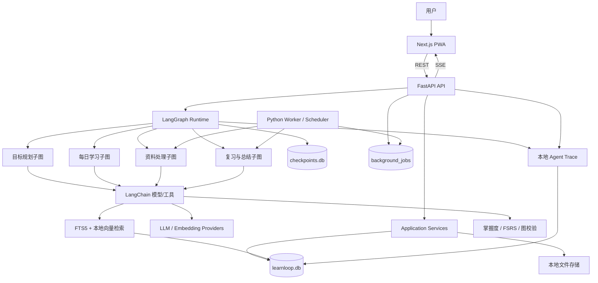

# LearnLoop 第一版项目规划

## 0. 项目定位与第一版边界

LearnLoop 是一个本地优先的自适应学习 Agent。它根据用户的学习目标、已有资料、可用时间、练习表现和复习历史，持续完成“诊断—规划—学习—练习—评估—更新掌握度—安排复习”的闭环。

第一版目标不是做一个通用 AI 家教，也不是做多个 Agent 自由聊天，而是完成一个可运行、可恢复、可评测的个人学习系统。

不属于第一版的数据库、部署、多 Agent、本地模型和外部集成方案统一记录在 `LearnLoop_future_evolution.md`，避免未来设想侵入第一版范围。

第一版只支持：

- 单用户、本地运行。
- 同时维护少量学习目标。
- Markdown、纯文本、PDF 和单个网页 URL 四类资料。
- 概念讲解、选择题、简答题；代码题作为第一版后半阶段功能。
- 一次 20～45 分钟的学习会话。
- 本地 SQLite、本地文件存储，不依赖 Docker、PostgreSQL、Redis 或云端基础设施。
- 默认使用在线 LLM API，但通过接口隔离模型厂商。

第一版不包含：

- 多租户 SaaS、组织和付费系统。
- 原生移动端或桌面端。
- 无限制网页爬取、视频转录和 Office 全格式解析。
- 多 Agent 自由对话。
- Kubernetes、消息队列集群和分布式 Worker。
- 自动模型训练或微调。

## 一、技术栈规划

### 1.1 总体技术决策

| 层次 | 第一版选择 | 主要用途 |
| --- | --- | --- |
| 客户端 | Next.js、React、TypeScript、PWA | 跨平台学习界面 |
| UI | Tailwind CSS、shadcn/ui | 组件和样式 |
| 前端数据 | TanStack Query | 请求、缓存和刷新 |
| 图形与统计 | React Flow、ECharts 或 Recharts | 学习路径和掌握度展示 |
| 实时通信 | REST + SSE | CRUD 与 Agent 事件流 |
| 后端 | Python 3.12、FastAPI、Pydantic v2 | API、Agent 服务和结构化数据 |
| ORM 与迁移 | SQLAlchemy 2、Alembic、aiosqlite | SQLite 数据访问和迁移 |
| Agent | LangGraph、LangChain | 工作流与 LLM/Tool/RAG 集成 |
| 业务数据库 | SQLite `learnloop.db` | 领域数据和后台任务 |
| Agent Checkpoint | SQLite `checkpoints.db` | LangGraph 暂停与恢复 |
| 文本检索 | SQLite FTS5 | 本地关键词检索 |
| 向量检索 | SQLite 保存 Embedding，NumPy 计算相似度 | 第一版小规模语义检索 |
| 文件存储 | 本地 `data/` 目录 + 存储接口 | 原始文件和派生产物 |
| 后台任务 | 单进程 Python Worker + SQLite Job 表 | 解析、Embedding、复习调度 |
| 复习算法 | FSRS | 确定性间隔复习 |
| Python 工具 | uv、Ruff、pytest、mypy/pyright | 依赖、质量和测试 |
| 前端工具 | pnpm、Vitest、Playwright | 依赖和测试 |

### 1.2 前端

前端采用 Next.js App Router，但业务形态保持为客户端应用，避免依赖 Next.js 服务端业务逻辑。生产构建可以输出静态资源，由 FastAPI 或一个轻量静态服务器提供。

选择 PWA 的原因：

- 浏览器天然跨 Windows、macOS 和 Linux。
- 可以安装到桌面或移动设备主屏幕。
- 一套代码即可提供应用式体验。
- 后续可以增加离线缓存和 Web Push，不需要立即维护原生客户端。

第一版页面：

1. `Dashboard`：今日任务、复习数量、连续学习情况。
2. `Goals`：创建目标、查看阶段和学习路径。
3. `Study Session`：讲解、提问、作答、反馈和会话恢复。
4. `Resources`：上传资料、查看解析状态和知识点关联。
5. `Knowledge Map`：展示知识点和前置依赖。
6. `Progress`：掌握度、练习正确率和复习历史。
7. `Agent Runs`：展示节点、工具、耗时、错误和重试。
8. `Settings`：模型、Embedding、数据目录和学习偏好。

普通数据使用 REST；学习会话的节点进度、Token 增量、工具状态和中断信息通过 SSE 推送。第一版不使用 WebSocket。

### 1.3 后端

后端采用分层结构：

- API 层：HTTP、SSE、校验、错误响应。
- Application 层：用例编排和事务边界。
- Agent 层：LangGraph 图、节点、状态、工具和 Prompt。
- Domain 层：掌握度、学习计划、知识图谱和复习规则。
- Infrastructure 层：SQLite、文件、模型、Embedding 和解析器实现。

领域规则不得依赖 FastAPI、LangChain 或具体数据库实现。Agent 节点通过应用服务和接口访问领域能力。

### 1.4 SQLite 数据库

第一版使用两个 SQLite 文件：

```text
data/db/learnloop.db     # 业务数据、评测结果和后台任务
data/db/checkpoints.db   # LangGraph Checkpoint
```

分离原因：

- Checkpoint 是 Agent 运行时状态，不是业务事实。
- 避免 LangGraph 高频写入和业务事务互相干扰。
- 未来可以分别迁移，不让业务查询依赖 Checkpoint 内部表。

SQLite 初始化时启用：

- `PRAGMA foreign_keys = ON`
- `PRAGMA journal_mode = WAL`
- 合理的 `busy_timeout`
- 数据库迁移版本检查

第一版限制为单 API 进程、单 Worker 进程，避免 SQLite 多写者争用。所有写事务保持短小，不在数据库事务中调用 LLM 或执行文件解析。

### 1.5 本地检索

第一版不引入独立向量数据库：

1. 文本块及元数据保存在 SQLite。
2. FTS5 提供关键词检索。
3. Embedding 以紧凑二进制格式保存在 SQLite。
4. 语义检索从候选集合加载向量，由 NumPy 计算余弦相似度。
5. 使用 Reciprocal Rank Fusion 合并关键词和向量结果。

该方案面向个人资料库，第一版将资料块规模控制在约数万级。`Retriever` 和 `VectorIndex` 必须定义接口，Agent 不直接执行 SQLite SQL。

### 1.6 本地文件存储

默认目录：

```text
data/
├── db/
├── resources/original/
├── resources/derived/
├── exports/
├── logs/
└── temp/
```

定义存储接口：

```text
DocumentStorage
├── save(stream, metadata) -> StoredObject
├── open(object_id) -> BinaryIO
├── exists(object_id) -> bool
├── delete(object_id) -> None
└── checksum(object_id) -> str
```

数据库只保存对象 ID、相对路径、Hash、MIME、大小和状态，不保存机器相关的绝对路径。写入使用临时文件加原子重命名，删除操作进入回收区或保留可恢复记录。

### 1.7 后台任务与调度

后台任务不依赖 PostgreSQL、Redis 或 Docker。FastAPI 将任务写入 `background_jobs` 表，独立 Python Worker 轮询并领取任务。

任务字段至少包括：

- `id`、`type`、`payload_json`
- `status`、`priority`
- `scheduled_at`
- `attempt_count`、`max_attempts`
- `locked_by`、`lease_until`
- `idempotency_key`
- `last_error`
- `created_at`、`started_at`、`finished_at`

Worker 规则：

- 第一版只运行一个 Worker。
- 领取任务使用短事务和租约，进程崩溃后可以重新领取。
- 每类任务必须定义幂等键。
- 使用指数退避重试，不无限重试。
- 资料解析、Embedding、周报和复习队列生成在 Worker 中运行。
- 定时器只负责向 Job 表写任务，不直接执行业务。

提供跨平台 Python 启动器，例如：

```text
uv run python scripts/dev.py
```

由启动器管理 API、Worker 和前端开发进程，避免依赖 Bash、Make 或 PowerShell 专属脚本。

### 1.8 模型与 Embedding

通过 LangChain 和自定义 Provider Registry 隔离模型厂商：

- 默认工具调用模型：支持结构化输出和 Tool Calling 的模型。
- 可选 Provider：DeepSeek、OpenAI、Anthropic、Gemini、Ollama。
- Embedding 独立配置，不要求与聊天模型同一厂商。

模型配置保存在用户配置文件或环境变量中；API Key 不写入 Git，不进入 Agent State，不写入普通日志。

### 1.9 测试和可观测性

测试栈：

- 后端单元测试：pytest。
- SQLite 集成测试：每个测试使用临时数据库和迁移。
- Agent 图测试：Fake Model、Fake Tool、固定随机种子。
- 前端测试：Vitest。
- 端到端测试：Playwright。
- Agent 评测：独立 `evals/` 数据集和运行器。

可观测性第一版保存在本地：

- JSON 结构化日志。
- `agent_runs`、`agent_events` 和 `tool_calls` 表。
- 节点耗时、模型耗时、Token、工具错误、重试和中断。
- 不记录模型隐藏推理过程，只记录结构化决策、输入摘要、工具参数和结果摘要。

## 二、Agent 框架选择

### 2.1 结论

第一版同时使用 LangGraph 和 LangChain：

- LangGraph 是主工作流和运行时。
- LangChain 提供模型、Tool、结构化输出、Embedding 和 Retriever 集成。
- FSRS 与掌握度计算属于确定性领域逻辑，不交给 LLM。

### 2.2 LangGraph 的职责

使用 LangGraph `StateGraph` 实现：

- 节点、条件分支和受限循环。
- 学习会话状态。
- 子图复用。
- SQLite Checkpoint。
- `interrupt()` 等待用户作答或批准。
- 恢复未完成会话。
- SSE 流式事件。
- 超时、重试和错误路由。

Checkpoint 使用 `langgraph-checkpoint-sqlite` 的异步实现。所有运行都必须设置稳定的 `thread_id`，并将它映射到 LearnLoop 的 `study_session_id`。

### 2.3 LangChain 的职责

使用 LangChain 实现：

- Chat Model Provider 适配。
- Tool Schema 和调用。
- Pydantic 结构化输出。
- Embedding Provider。
- 文档和消息抽象。
- Retriever 适配。
- 必要的模型调用中间件。

第一版不把整个 LearnLoop 包装成一个通用 `create_agent()`。确定流程使用 `StateGraph` 显式建模；只有未来某个节点确实需要开放式工具循环时，才在该节点内部嵌套受限 Agent。

### 2.4 确定性代码与 LLM 的边界

LLM 负责：

- 理解和澄清学习目标。
- 候选知识点与依赖关系生成。
- 基于资料生成讲解和练习。
- 对简答题按 Rubric 提取证据并给出候选评价。
- 识别可能的错误类型。
- 生成个性化反馈。

普通代码负责：

- FSRS 时间计算。
- 客观题判分。
- 代码题测试结果。
- 掌握度数值更新。
- 图结构校验和环检测。
- 权限、预算、超时和重试。
- 数据库事务和幂等。

## 三、LearnLoop 整体架构



核心请求链路：

1. 前端创建或继续一个学习会话。
2. API 创建 `agent_run`，启动对应 LangGraph。
3. Graph 读取领域数据并执行节点。
4. 节点通过 LangChain 调用模型或工具。
5. Graph 事件经 SSE 推送到前端。
6. 等待用户作答时调用 `interrupt()` 并保存 Checkpoint。
7. 用户提交答案后，API 使用同一 `thread_id` 恢复执行。
8. Graph 将最终业务结果通过应用服务写入 `learnloop.db`。

## 四、核心工作流设计

### 4.1 学习目标规划子图

```text
接收目标
  → 检查目标完整性
  → [不完整] interrupt 询问用户
  → 生成诊断题
  → interrupt 等待作答
  → 评估起点
  → 生成候选知识点和依赖
  → 确定性图校验
  → 生成阶段计划
  → interrupt 等待批准/修改
  → 保存目标、知识图和计划
```

目标必须包含主题、期望结果、截止时间或节奏、每周可用时间。计划生成失败或知识图有环时，返回修复节点，最多重试两次。

### 4.2 资料处理子图

```text
登记资料
  → 后台任务读取文件/URL
  → MIME 与大小校验
  → 文本解析
  → 清洗和章节切分
  → 分块
  → 提取元数据和候选知识点
  → 生成 Embedding
  → 写入 FTS5 和 Embedding
  → 关联学习目标
  → 标记 ready 或 failed
```

每个阶段均写入状态，失败后从最后安全阶段重试。文件 Hash 用于去重，解析结果携带页码、标题或字符范围，保证后续引用可追溯。

### 4.3 每日学习子图

```text
加载用户和目标状态
  → 选择今日知识点
  → 检索相关资料
  → 生成带引用的讲解
  → interrupt 展示并等待继续
  → 生成练习
  → interrupt 等待作答
  → 评估答案
  → [掌握] 更新掌握度
  → [部分掌握] 补充讲解 → 新练习
  → [未掌握] 诊断误区 → 前置知识补救 → 新练习
  → 生成会话总结
  → FSRS 安排复习
  → 保存结果并结束
```

约束：

- 补救循环最多两轮。
- 每次会话配置最大模型调用次数、Token 和总时长。
- 没有足够资料时明确提示，不让模型伪造来源。
- 用户可以质疑评分；纠正结果进入反馈数据，而不是直接覆盖历史记录。

### 4.4 复习与周报子图

```text
读取到期复习项
  → FSRS 排序
  → 根据错误历史生成复习题
  → interrupt 等待作答
  → 评估并更新复习记录
  → 更新掌握度
  → 生成下次复习时间
```

周报作为后台任务执行：聚合确定性指标，LLM 只负责把指标和事件整理成自然语言总结。计划变更必须由用户批准。

### 4.5 错误处理流程

错误分为：

- 可重试：模型超时、限流、临时网络失败。
- 可降级：Embedding 失败时先使用 FTS5；开放题评分失败时保存待评估状态。
- 需要用户处理：文件损坏、API Key 无效、学习目标歧义。
- 不可恢复：迁移失败、数据完整性错误；停止相关任务并保留诊断信息。

## 五、Agent State 设计

### 5.1 状态原则

- 只保存恢复当前 Graph 所必需的数据。
- 仅使用可序列化的标量、列表、字典和 Pydantic 数据。
- 不保存 ORM Session、文件句柄、数据库连接或 Provider Client。
- 大文档和完整检索结果保存到业务库，State 只保留 ID 和摘要。
- API Key 和敏感配置不进入 State。

### 5.2 学习会话 State

```python
class StudySessionState(TypedDict):
    user_id: str
    goal_id: str
    study_session_id: str
    thread_id: str

    phase: str
    target_concept_ids: list[str]
    source_chunk_ids: list[str]

    lesson: dict | None
    exercise_id: str | None
    attempt_id: str | None
    evaluation: dict | None

    remediation_count: int
    model_call_count: int
    token_budget_remaining: int

    pending_interrupt: dict | None
    warnings: list[dict]
    errors: list[dict]
```

### 5.3 State 与业务数据提交

Agent 节点先产生结构化结果，再由应用服务在短事务中提交业务数据。每次提交带 `run_id` 和幂等键，避免 Graph 恢复时重复写入练习、作答或掌握度记录。

## 六、记忆系统设计

| 记忆类型 | 内容 | 存储 | 生命周期 |
| --- | --- | --- | --- |
| Working Memory | 当前节点、练习、重试和预算 | `checkpoints.db` | 单次 Graph/会话 |
| Episodic Memory | 学习会话、作答、错误和反馈 | `learnloop.db` | 长期 |
| Semantic Memory | 偏好、目标、知识点和掌握度 | `learnloop.db` | 长期、持续更新 |
| Knowledge Memory | 用户上传资料和可引用文本块 | 本地文件 + SQLite/FTS5 | 由用户管理 |
| Schedule Memory | 到期复习、FSRS 参数和历史 | `learnloop.db` | 长期 |

记忆更新规则：

- 原始作答和历史掌握度只追加，不原地抹除。
- 当前掌握度可以是历史事件的投影值。
- LLM 提取的偏好必须标记来源和置信度。
- 用户纠正优先于模型推断。
- 对过期或矛盾偏好保留历史并标记失效。

## 七、核心数据模型

### 7.1 用户与目标

- `users`：本地用户配置。
- `learning_goals`：目标、预期成果、节奏和状态。
- `knowledge_nodes`：知识点、描述和难度。
- `knowledge_edges`：前置、包含和相关关系。
- `study_plans`：计划版本和审批状态。
- `plan_items`：阶段、顺序、预计时长和完成状态。

### 7.2 资料与检索

- `learning_resources`：文件/URL、Hash、解析状态和存储对象 ID。
- `resource_chunks`：文本块、位置、元数据和 FTS 字段。
- `chunk_embeddings`：模型、维度和二进制向量。
- `resource_concepts`：资料块与知识点关联及置信度。

### 7.3 学习与复习

- `study_sessions`：开始、结束、目标、状态和 Graph Thread ID。
- `lessons`：生成内容、引用、Prompt 版本和模型信息。
- `exercises`：题型、题目、答案、Rubric、来源和难度。
- `exercise_attempts`：用户答案、用时、原始评分和最终评分。
- `evaluation_results`：规则分、模型分、证据和用户纠正。
- `mastery_events`：导致掌握度变化的不可变事件。
- `mastery_snapshots`：知识点当前掌握度投影。
- `review_schedules`：FSRS 状态和下次时间。
- `review_logs`：每次复习评级和间隔。

### 7.4 Agent 与系统

- `agent_runs`：Graph、状态、模型、开始结束时间和预算。
- `agent_events`：节点、事件类型、摘要和时间。
- `tool_calls`：工具、结构化参数、结果摘要、耗时和错误。
- `prompt_versions`：Prompt 名称、版本、Hash 和启用状态。
- `user_feedback`：对计划、讲解、题目和评分的反馈。
- `background_jobs`：后台任务、租约、重试和幂等信息。
- `evaluation_runs`：离线评测配置、版本和结果。

所有表使用应用生成的 UUID，时间统一以 UTC 保存，展示时再转换本地时区。

## 八、这个项目应实现哪些 Agent 能力？

### 8.1 第一版必须实现

1. **目标理解与澄清**：识别缺失条件并通过 Interrupt 询问用户。
2. **任务规划**：将目标拆成阶段、知识点和计划项。
3. **Tool Calling**：调用检索、资料、图校验、FSRS、评分和代码工具。
4. **有状态编排**：使用 LangGraph 表达条件、循环和子图。
5. **结构化输出**：计划、练习、评分和反馈均通过 Schema 校验。
6. **RAG 与引用**：讲解和题目关联具体资料块。
7. **多层记忆**：区分运行状态、历史事件、掌握度和知识资料。
8. **Human-in-the-loop**：目标补充、计划审批、作答和评分纠正。
9. **持久化与恢复**：进程退出后能继续未完成会话。
10. **自适应决策**：根据结果选择推进、补救或回到前置知识。
11. **流式反馈**：前端能够观察当前节点和工具状态。
12. **受限反思与纠错**：最多进行有限次数的诊断和重生成。
13. **预算与防护**：限制模型调用、Token、时间、循环和工具权限。
14. **可观测性**：记录节点、工具、模型、错误和耗时。
15. **可评测性**：能够用固定数据和 Fake Provider 重放运行。

### 8.2 第一版不将“多 Agent”作为验收要求

多 Prompt 或多个 LLM 节点不等于多 Agent。第一版先证明单个状态图能够可靠完成学习闭环。只有当独立上下文、工具权限或生命周期带来实际价值时，才拆分 Tutor、Evaluator 或 Curator 子 Agent。

## 九、评测体系

### 9.1 评测原则

- 从第一阶段开始建设，不在项目末尾补评测。
- 评测集、Prompt、模型参数和随机种子均版本化。
- 确定性检查优先于 LLM Judge。
- 同时评估结果、过程、成本和可靠性。
- 保存失败轨迹，允许回放和分类。

### 9.2 确定性测试

- 客观题答案和分数。
- 代码题单元测试通过率。
- FSRS 调度结果。
- 知识依赖图环检测。
- Graph 分支、最大循环和预算终止。
- Checkpoint 暂停、进程重启和恢复。
- Tool Schema 与参数校验。
- Job 幂等、租约超时和重试。
- 数据库迁移和外键完整性。

### 9.3 RAG 评测

- `Recall@K`：正确资料块是否出现在候选中。
- `MRR`：正确资料块排名。
- 引用覆盖率：关键论断是否有引用。
- 引用支持率：引用是否真正支持论断。
- 跨目标污染率：是否检索了不相关目标资料。
- 无答案拒答率：资料不足时是否明确说明。

### 9.4 练习和评分评测

建立人工标注样本：标准答案、部分正确、常见误区、无关答案和对抗答案。比较：

- Agent 分数与人工分数差异。
- 错误类型识别准确率。
- 反馈是否命中缺失知识点。
- 题目是否可以从引用资料回答。
- 难度是否与目标掌握度匹配。

开放题采用规则、关键点、Rubric、LLM 评价和用户纠正的组合，不让 LLM 单独决定最终事实。

### 9.5 Agent 过程评测

- 目标澄清成功率。
- 计划 Schema 有效率。
- Tool 选择和参数正确率。
- 会话完成率。
- 平均模型调用数和无效调用率。
- 超时、循环和失败恢复率。
- 平均 Token、延迟和费用。

### 9.6 Baseline 与消融

至少保留以下对照：

1. 直接 LLM Chatbot。
2. 固定 Prompt + RAG。
3. LearnLoop 完整状态图。
4. 移除掌握度自适应。
5. 移除 FSRS。
6. 仅关键词检索与混合检索。

### 9.7 第一版验收目标

- 完成“目标—诊断—计划—学习—练习—复习”端到端流程。
- 中断后关闭并重启服务，仍能继续会话。
- 所有计划、练习和评价结构化输出通过 Schema 校验或进入明确失败状态。
- 客观题判分和 FSRS 测试保持确定性。
- RAG 回答显示可定位到页码或章节的引用。
- 所有 Agent Run 可以查看节点、工具、错误、Token 和耗时。
- 至少建立 50 条离线评测样本和一份可复现报告。

## 十、推荐项目目录

```text
learnloop/
├── frontend/
│   ├── src/app/
│   ├── src/components/
│   ├── src/features/
│   ├── src/lib/
│   └── tests/
├── backend/
│   ├── app/
│   │   ├── api/
│   │   ├── application/
│   │   ├── agent/
│   │   │   ├── graphs/
│   │   │   ├── nodes/
│   │   │   ├── tools/
│   │   │   ├── prompts/
│   │   │   ├── states/
│   │   │   └── middleware/
│   │   ├── domain/
│   │   │   ├── goals/
│   │   │   ├── knowledge/
│   │   │   ├── mastery/
│   │   │   ├── exercises/
│   │   │   └── review/
│   │   ├── infrastructure/
│   │   │   ├── database/
│   │   │   ├── storage/
│   │   │   ├── llm/
│   │   │   ├── embeddings/
│   │   │   └── parsers/
│   │   ├── workers/
│   │   └── main.py
│   ├── migrations/
│   ├── evals/
│   │   ├── datasets/
│   │   ├── evaluators/
│   │   └── reports/
│   └── tests/
├── data/
│   ├── db/
│   ├── resources/
│   ├── exports/
│   ├── logs/
│   └── temp/
├── scripts/
│   ├── dev.py
│   ├── migrate.py
│   ├── run_worker.py
│   └── evaluate.py
├── docs/
│   ├── architecture/
│   ├── adr/
│   ├── api/
│   └── evaluation/
├── .env.example
├── README.md
└── LICENSE
```

`data/` 中只提交空目录说明和示例数据，用户数据库、资料、日志和密钥均加入 `.gitignore`。

## 十一、开发阶段

### 阶段 0：工程骨架与架构约束

交付：

- 前后端项目骨架。
- SQLite 与 Alembic。
- 配置、日志、错误模型。
- Repository 和 Storage 接口。
- 跨平台开发启动脚本。
- CI 中的 Lint、类型检查和测试。

### 阶段 1：最小学习闭环

交付：

```text
创建目标
→ 生成七天计划
→ 用户批准
→ 开始学习会话
→ 生成一题
→ 用户作答
→ 评分
→ 保存结果
```

这一阶段使用少量内置资料，先不做完整 RAG。

### 阶段 2：LangGraph 状态、Interrupt 与恢复

交付：

- 目标规划和每日学习 StateGraph。
- `AsyncSqliteSaver`。
- 稳定的 Thread/Session 映射。
- 用户作答和计划审批 Interrupt。
- API 重启后的会话恢复测试。
- SSE Agent 事件流。

### 阶段 3：资料处理与本地 RAG

交付：

- Markdown、TXT、PDF、单 URL 导入。
- 后台 Job 和单 Worker。
- 分块、FTS5、Embedding 与混合检索。
- 引用页码/章节。
- 资料解析失败与重试界面。

### 阶段 4：自适应学习

交付：

- 知识点依赖图。
- 掌握度事件和快照。
- 错误类型和补救分支。
- FSRS 复习队列。
- 每日选题和周报。

### 阶段 5：评测与工程完善

交付：

- 固定评测集、Baseline 和消融。
- Agent Run/Tool Call 页面。
- Token、延迟和错误统计。
- Playwright 端到端测试。
- 数据导入导出和备份。
- PWA Manifest 和安装体验。
- 架构文档、演示数据和演示视频脚本。

### 第一版完成定义

第一版完成时，一名新用户应能在没有 Docker 和外部数据库的情况下：

1. 安装 Node.js、Python、pnpm 和 uv。
2. 配置一个模型 API Key。
3. 运行一个跨平台启动命令。
4. 导入自己的学习资料。
5. 创建学习目标并完成诊断。
6. 获得并批准学习计划。
7. 完成学习、练习和复习。
8. 中途关闭应用并在下次恢复。
9. 查看掌握度、引用和 Agent 运行轨迹。
10. 运行离线评测并得到可复现报告。
